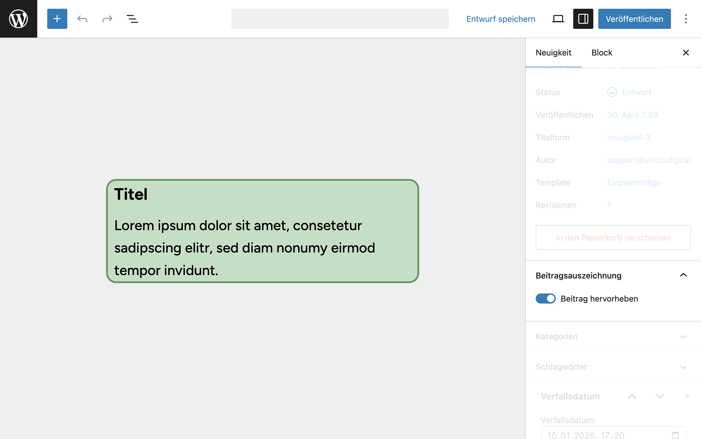
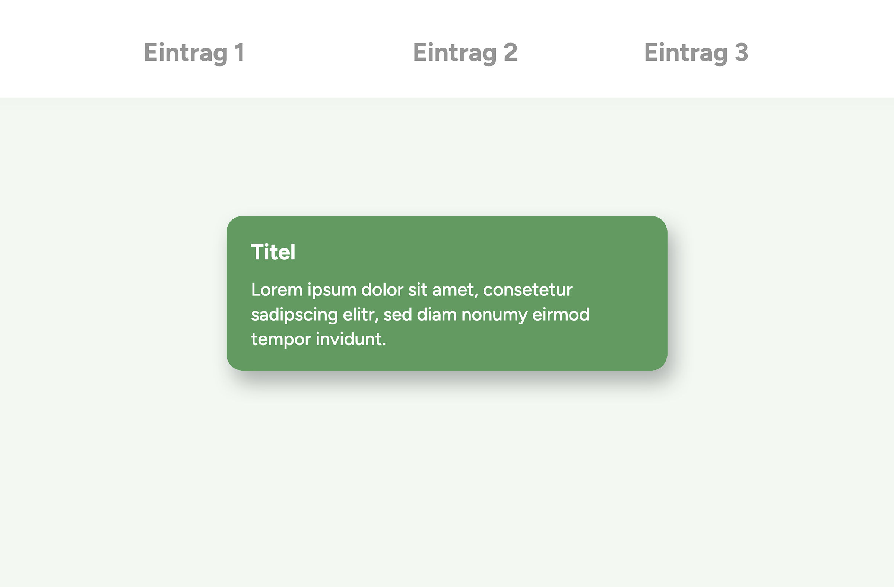

# UD Plugin: Beitragsauszeichnung

Dieses Plugin ermöglicht es, Beiträge oder Blöcke im Editor und im Frontend visuell hervorzuheben. Ideal für Hinweise, wichtige Beiträge oder visuelle Gruppierungen im Layout.
Die Farben basieren auf Theme-Variablen (z. B. --wp--preset--color--highlight-500) und haben Fallbacks, falls keine Theme-Farben definiert sind.

## Funktionen

- Visuelle Hervorhebung durch die CSS-Klasse `is-highlighted`
- Einheitliche Gestaltung im Editor (`editor.css`) und im Frontend (`frontend.css`)
- Integration in Gutenberg-kompatible Themes
- Fallback-Farben für Kompatibilität ohne Block-Themes
- Automatisches Setzen der CSS-Klasse auch im Editor‑iFrame (Canvas‑Bereich)

## Anwendung

Aktiviere im Dokument-Panel des Editors die Option „Beitrag hervorheben“.
Das Plugin weist dem Beitrag automatisch die CSS-Klasse `is-highlighted` zu.

**💡 Damit die Hervorhebung korrekt im Editor sichtbar ist, wird die zusätzliche Klasse editor-post-is-highlighted gezielt im iFrame‑<body> des Block-Editors gesetzt, da Gutenberg Inhalte in einem isolierten iFrame rendert**

## Vorschau

### Im Editor


*Abbildung: Der Beitrag ist im Editor durch grüne Hinterlegung hervorgehoben.*

### Im Frontend


*Abbildung: Im Frontend zeigt sich die Hervorhebung mit den definierten Farben – basierend auf Theme-Variablen oder Fallbacks.*

## CSS-Auszug

```css
background-color: var(--wp--preset--color--highlight-100, #CCE2CF);
border-color: var(--wp--preset--color--highlight-500, #4C9C5A);
```

## Installation

1. Plugin in den Ordner wp-content/plugins/ kopieren
2. Plugin im WordPress-Backend aktivieren
3. Optionale CSS-Klasse is-highlighted in einem Beitrag oder Block verwenden

<!--
Interne Verwendung:
Eingesetzt in den Projekten
- illgau.ch
- schule.illgau.ch
- bbzg.ch
-->
