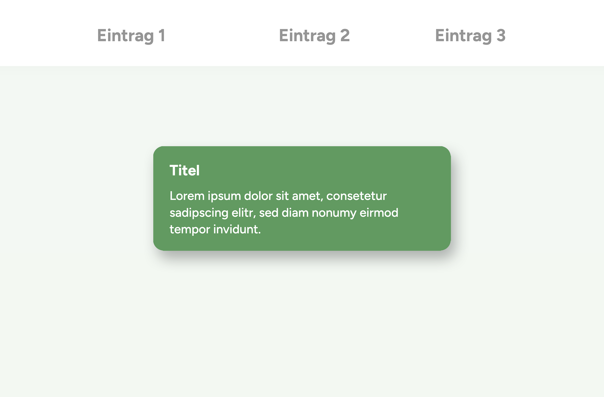
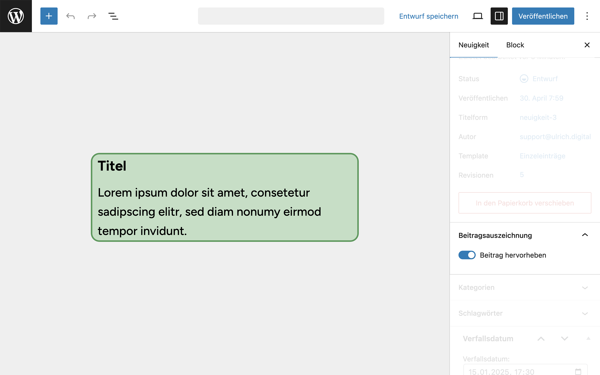

# UD Plugin: Beitragsauszeichnung

Dieses Plugin ermöglicht es, Beiträge oder Blöcke im Editor und im Frontend visuell hervorzuheben. Ideal für Hinweise, wichtige Beiträge oder visuelle Gruppierungen im Layout.
Die Farben basieren auf Theme-Variablen (z. B. --wp--preset--color--highlight-500) und haben Fallbacks, falls keine Theme-Farben definiert sind.

## Funktionen

- Visuelle Hervorhebung durch die CSS-Klasse `is-highlighted`
- Einheitliche Gestaltung im Editor (`editor.css`) und im Frontend (`frontend.css`)
- Integration in Gutenberg-kompatible Themes
- Fallback-Farben für Kompatibilität ohne Block-Themes
- Automatisches Setzen der CSS-Klasse auch im Editor‑iFrame (Canvas‑Bereich)

## Screenshots

*Im Frontend zeigt sich die Hervorhebung mit den definierten Farben – basierend auf Theme-Variablen oder Fallbacks.*

*Der Beitrag ist im Editor durch grüne Hinterlegung hervorgehoben.*

## Einblicke in die Umsetzung

Der Beitrag gibt Einblick in die entwickelte Lösung und ihre Funktionsweise.

- **Mehr zur Lösung:** [Wichtige Inhalte in WordPress hervorheben](https://ulrich.digital/wichtige-inhalte-in-wordpress-hervorheben/)

## Autor

[ulrich.digital gmbh](https://ulrich.digital)

## Lizenz

Dieses Projekt steht unter der [ulrich.digital Nutzungslizenz 1.0](LICENSE).

Die unveränderte Software darf in eigenen und kommerziellen Projekten eingesetzt werden. Auf jeder öffentlich erreichbaren Website oder Anwendung muss [ulrich.digital gmbh](https://ulrich.digital) im Impressum, in einem Credits-Bereich oder auf einer vergleichbaren Informationsseite genannt werden. Verkauf, eigenständige Weitergabe, Unterlizenzierung und Änderungen bedürfen der vorherigen schriftlichen Zustimmung von ulrich.digital gmbh.

Komponenten Dritter behalten ihre jeweiligen Lizenz- und Nutzungsbedingungen.

<!--
Interne Verwendung:
Eingesetzt in den Projekten
- illgau.ch
- schule.illgau.ch
- bbzg.ch
-->
